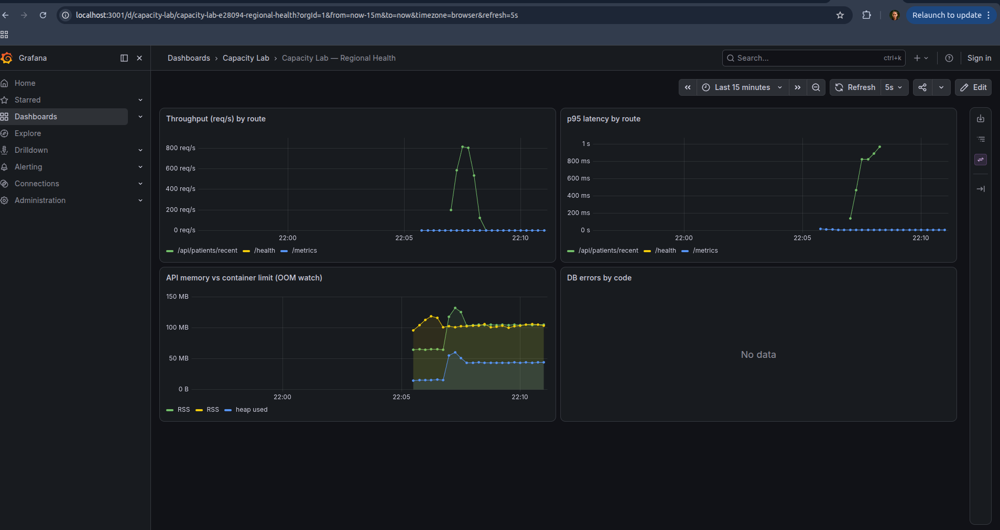
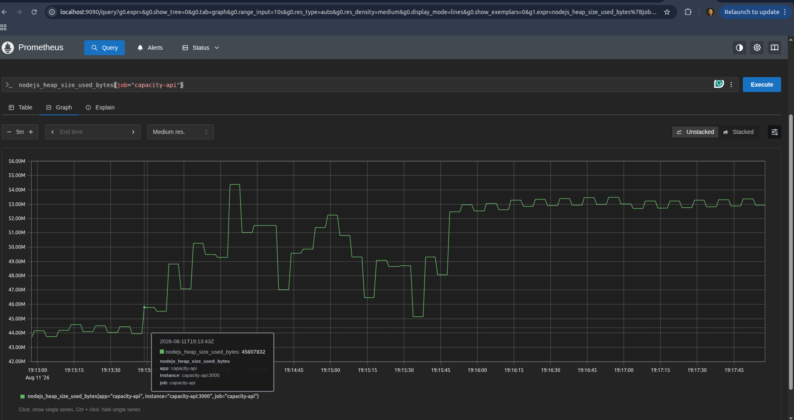

#  On-Call Lab Journal — Regional Health

**Engineer:** Rigbe Weleslasie  **Date:** 2026-08-10

This is my investigation notebook. I am on call for the Regional Health
platform and working the [incident queue](./incidents/README.md). For each
incident I will:

1. **Hypothesis** — from the ticket symptoms alone, predict the cause *before*
   you run anything.
2. **Observation** — record real evidence: k6 output, Grafana/Prometheus
   metrics, `EXPLAIN ANALYZE` plans, lock views, `docker stats`, container logs.
3. **Root cause & mechanism** — explain *why* it happens. Name the database/OS
   mechanic yourself and show the capacity math.
4. **Fix & verify** — make the change, re-run the reproduction, and record the
   before/after.

> There is no answer key. A claim without evidence isn't a diagnosis. "It felt
> slow" is not an observation; `p(95)=1840ms, http_req_failed=32%` is.

---

## How to capture evidence

- **k6:** copy the summary block (`http_req_duration`, `http_req_failed`,
  `iterations`, `vus`).
- **MySQL:** `docker compose exec mysql-db mysql -uroot -plabpassword capacity_lab`
  then run `EXPLAIN ANALYZE ...`, `SHOW CREATE TABLE ...`,
  `SHOW ENGINE INNODB STATUS\G`, or query `performance_schema` / `sys`.
- **Metrics:** Grafana panels or raw Prometheus at http://localhost:9090.
- **Memory / restarts:** `docker stats`, `docker compose logs -f capacity-api`.

Useful Prometheus queries:
```promql
# Throughput (req/s) by route
sum(rate(http_requests_total[1m])) by (route)

# p95 latency by route
histogram_quantile(0.95, sum(rate(http_request_duration_seconds_bucket[1m])) by (le, route))

# Application heap in use
nodejs_heap_size_used_bytes

# DB errors by code
sum(rate(db_errors_total[1m])) by (code)
```

All raw evidence referenced below lives in [`evidence/`](./evidence/).
Environment note: local MySQL host port was remapped `3307:3306` in
`docker-compose.yml` because this machine already runs a MariaDB instance on
`127.0.0.1:3306` — the container's internal port (and everything the app
talks to) is unchanged.

---

## Baseline — steady state (do this first)
*Run:* `k6 run load-tests/00-baseline.js` (healthy system, no incident)
*Evidence:* `evidence/00-baseline-output.txt`, `evidence/00-baseline-summary.json`

| Metric              | Value |
|---------------------|-------|
| Requests/sec (RPS)  | 49.8/s (VU-limited: 50 VUs × 1 req/s each, `sleep(1)`) |
| p50 latency         | 1.52 ms |
| p95 latency         | 4.96 ms |
| p99 latency         | 43.68 ms |
| Error rate          | 0.00% |
| Peak API heap used  | 19.86 MB (`nodejs_heap_size_used_bytes`) |

> SLOs held for every incident below: **p95 < 300ms, error rate < 1%, RPS not
> materially below the offered load** for cheap/indexed endpoints; admissions
> to a single hot row are explicitly exempted from the RPS floor (see
> OPS-2203 — single-row serialization is a hard physical limit, not a config
> bug).

---

## Investigation — OPS-2201
*Ticket:* [Patient name search unusably slow at shift change](./incidents/OPS-2201.md)
*Reproduce:* `k6 run load-tests/reproduce-OPS-2201.js`

### Hypothesis
> From the symptoms alone (fast when isolated, collapses under concurrent
> searches, other endpoints unaffected), I think the cause is **a missing
> index on `patients.last_name`, forcing a full table scan per search**,
> because a full scan's cost scales with table size and competes for DB
> CPU/buffer-pool access under concurrency, while a PK-ordered `LIMIT 50`
> query (like `/recent`) stays cheap regardless of load. I expect the
> "other endpoints unaffected" part of the ticket to be **only partially
> true** once the pool is shared — worth testing directly.

### Observation (evidence)
*Full evidence:* `evidence/OPS-2201-explain.txt`, `evidence/OPS-2201-repro-output.txt`,
`evidence/OPS-2201-processlist.txt`, `evidence/OPS-2201-recent-during-search.txt`

```
SHOW CREATE TABLE patients -> only PRIMARY KEY(id). No index on last_name.

EXPLAIN ANALYZE SELECT * FROM patients WHERE last_name = 'Smith':
-> Filter: (patients.last_name = 'Smith')  (cost=10276 rows=9819)
   (actual time=0.0368..66.5 rows=10000 loops=1)
    -> Table scan on patients  (cost=10276 rows=98191)
       (actual time=0.0273..58.3 rows=100000 loops=1)

SELECT COUNT(*) FROM patients WHERE last_name='Smith'  ->  10000
```

Reproduction (200 VUs, 30s):
```
p(95)=14.77s   (threshold p(95)<300ms: FAILED)
RPS: 19.69/s
http_req_failed: 0.00%   <- ticket said "sometimes errors out"; we saw 0
                            errors, just catastrophic latency, under this
                            configuration. Worth noting as a ticket
                            correction.
```

Mid-load `SHOW PROCESSLIST` / `docker stats`:
```
mysql-db CPU: 88.94%      Threads_connected: 3   Threads_running: 3
capacity-api CPU: 168.00% (over 1 core)
```

Payload size: `curl .../search?lastName=Smith` = **3,636,195 bytes** (3.6MB,
10,000 rows) vs `curl .../recent` = **18,145 bytes** (18KB, 50 rows) — a
**200x** larger response for the popular-surname case.

**Disproving the ticket:** while the search burst ran, I hit `/api/patients/recent`
(the panel the reporter says "is always fast, even when search is dying")
five times in parallel with the load test:
```
recent call took 14.32 s
recent call took 10.10 s
recent call took 10.00 s
recent call took  0.57 s
recent call took  0.03 s
```
The "unaffected" panel stalled for **10-14 seconds** too. The ticket's claim
that only search is affected is **false** under this DB connection-pool
configuration — `/recent` shares the same 2-connection pool, and search's
long-held connections (big scan + big payload) starve it.

| Metric (under load) | Value        | vs. baseline        |
|----------------------|--------------|----------------------|
| p95 latency          | 14.77 s      | ~2977x baseline (4.96ms) |
| RPS                   | 19.69/s      | vs 49.8/s baseline (different offered load, not directly comparable) |
| Error rate            | 0.00%        | unchanged |
| Rows examined / req   | 100,000 (full scan) | vs the ideal ~10,000 (matches only) |

### Root cause & mechanism
`WHERE last_name = ?` has no supporting index, so MySQL performs a **full
table scan**: every request reads and filters all 100,000 rows
(`Table scan ... rows=100000`), regardless of how many rows actually match.
With a B-tree index on `last_name`, the same query becomes an **index range
lookup** that only touches matching rows. Cost difference for ~100,000 rows:
**O(N)=100,000 row reads per request (scan) vs. O(log N + matches)** — for a
name matching 10,000 rows that's still 10,000 touches, but for a less common
name (1/10 the frequency here) it would be ~1,000 — the scan pays the full
100,000-row cost *every time*, no matter how selective the search actually
is. Under concurrency, `connectionLimit: 2` means only 2 scans run
simultaneously, but each ties up a connection and a chunk of DB CPU for tens
of milliseconds (worse under CPU contention between the 2 concurrent scans),
and search's oversized JSON response further monopolizes both the DB
connection and the app's single event loop — which is why `/recent`, sharing
the same 2-connection pool, gets starved too.

### Fix & verify
**Change 1 — add the missing index** (`data-seed/seed.sh`:
`KEY idx_patients_last_name (last_name)`).
- `EXPLAIN ANALYZE` after: `Index lookup ... actual time=0.0247..35.1` (down
  from 66.5ms) — but re-running the 200-VU reproduction barely moved the
  needle: **p95=16.29s** (`evidence/OPS-2201-fixed-output.txt`) — statistically
  unchanged, even slightly worse. **The "obvious" fix did not fix the
  ticket.**
- Investigated why: `docker stats` mid-load showed **mysql-db CPU dropped to
  38.60%** (index working — DB is no longer the bottleneck) and
  `SHOW PROCESSLIST` showed **both connections idle ("Sleep")**. Meanwhile
  **capacity-api CPU was pegged at 171%** — the real bottleneck had moved to
  the *application tier*: serializing and writing a ~3.6MB, 10,000-row JSON
  response per request.

**Change 2 — cap the result set** (`api/server.js`:
`ORDER BY id DESC LIMIT ?`, capped at `MAX_SEARCH_RESULTS = 50`). Combined
with the index, MySQL's index lookup can now stop after 50 matches instead of
reading all 10,000.

**Re-run evidence** (`evidence/OPS-2201-fixed2-output.txt`):
```
p(95)=181.01ms   (threshold p(95)<300ms: PASSED)
RPS: 1233.77/s
http_req_failed: 0.00%
```
| | Before | After both fixes | Improvement |
|--|--------|-------------------|-------------|
| p95 | 14.77 s | 181.01 ms | **~81.6x** |
| RPS | 19.69/s | 1233.77/s | **~62.7x** |
| Payload (Smith) | 3.64 MB | 18.3 KB | **~199x** |

`/api/patients/recent` during a concurrent search burst, after the fix:
consistently **~0.17s** (`evidence/OPS-2201-recent-during-search-AFTER.txt`) —
down from 10-14s stalls.

**Trade-off:** search now returns at most 50 matches (`?limit=` up to 50,
ordered newest-first) instead of every match. For a common surname a nurse
now sees the 50 most recent patients with that name, not an exhaustive list —
reasonable for a "who do I have right now" lookup UI, but this is a real
behavior change that should be confirmed with clinical stakeholders, and a
"load more" / more-specific-filter (first name, DOB) affordance would be the
production-grade completion of this fix.

---

## Investigation — OPS-2202
*Ticket:* [Whole app freezes during surges, DB looks idle](./incidents/OPS-2202.md)
*Reproduce:* `k6 run load-tests/reproduce-OPS-2202.js`

### Hypothesis
> Given the query is trivial and the DB is idle yet requests pile up, I think
> the bottleneck is **the application's own MySQL connection pool** because
> only a fixed, small number of connections can be "in service" at once —
> anything beyond that queues inside the Node process, invisible to any
> DB-side dashboard, which would explain the DBAs correctly seeing a bored
> database.

### Observation (evidence)
*Full evidence:* `evidence/OPS-2202-repro-output.txt`, `evidence/OPS-2202-mid-evidence.txt`

`api/database.js` (before): `connectionLimit: 2, queueLimit: 0` (0 = unbounded
waiting, no rejection).

Reproduction (ramp to 2000 VUs, 30s @ 2000):
```
http_req_failed: 0.00%     (threshold rate<0.05: PASSED)
p(95)=1.76s   p(99)=1.88s
RPS: 1164.7/s
```
Ticket says "returns 500s" — under this exact config we saw **0% errors,
just severe latency** (queueLimit:0 means requests wait indefinitely rather
than being rejected). That part of the ticket is not quite right as stated —
the collapse is silent and slow, not loud and erroring, until the queue is
bounded (see Fix attempt 1 below, which is where real 500s showed up).

Mid-load `docker stats` + `SHOW PROCESSLIST`/status:
```
mysql-db:      CPU 27.42%   MEM 501MiB/14.46GiB
capacity-api:  CPU 155.38%  MEM 90.58MiB/160MiB
Threads_connected: 3   Threads_running: 2
SHOW PROCESSLIST -> both app connections in "Sleep" state at the sampled instant
```
DB CPU flat, both connections idle between uses — the ticket's "DB looks
idle" claim is **confirmed**, exactly as reported.

**Grafana screenshot**, captured live during a re-run against the *fixed*
system: throughput on `/api/patients/recent` spikes to ~800 req/s, p95
latency climbs toward 1s and — notably — **stays elevated for a few seconds
after the request rate has already dropped back to ~0**, which is the
queued-request drain effect predicted by the Little's Law math below,
visible in real time. Memory (RSS) settles at a new, slightly higher plateau
(~100MB, up from ~75MB) after the burst, consistent with the larger
`connectionLimit`/`maxIdle` (2->50) keeping more idle connections warm.



| Metric                          | Value    | vs. baseline |
|----------------------------------|----------|--------------|
| Successful RPS (plateau)         | 1164.7/s | n/a (baseline is VU-throttled) |
| p95 / p99 latency                | 1.76s / 1.88s | ~355x / ~43x baseline |
| Error / timeout rate             | 0.00%    | unchanged (queue absorbs everything) |
| Avg service time per query (DB)  | ~5ms (indexed PK-order LIMIT 50) | n/a |

### Root cause & mechanism
`connectionLimit: 2` means only 2 requests can ever be executing a MySQL
query at the same moment. mysql2's pool maintains its own **FIFO wait queue
inside the Node process** for every `getConnection()`/`query()` call beyond
that limit — this queueing happens entirely in the app tier, which is why a
DB-side dashboard (CPU, disk, connections-in-use) looks completely healthy
while users experience multi-second stalls. The query itself is fast and
cheap; the *scheduling* to get a turn on one of 2 slots is what's slow.

**Little's Law capacity math:**
- Offered concurrency (in-flight requests), L ≈ 2000 (2000 VUs, closed loop, no think time)
- Measured throughput, λ ≈ 1164.7 req/s
- Implied average time-in-system, **W = L / λ ≈ 2000 / 1164.7 ≈ 1.72s** — matches the measured p95 (1.76s) almost exactly.
- Real DB service time for this query, W_service ≈ 5ms (PK-order `LIMIT 50`).
- Connections actually *needed* to sustain λ=1164.7 req/s without queueing: **C = λ × W_service ≈ 1164.7 × 0.005 ≈ 5.8 → 6 connections.**
- `connectionLimit: 2` was undersized by **>100x** for this workload.

Why not make the pool arbitrarily large? Once the number of **concurrently
executing** queries (not just held connections) grows large enough to
saturate DB CPU/IO or contend for buffer-pool latches — exactly what OPS-2201
showed at 88% DB CPU with only 2 concurrent full scans — more connections
stop helping and start hurting (context switching, lock/latch contention).
The right pool size is bounded above by DB capacity, not just app demand.

### Fix & verify
**Attempt 1** — `connectionLimit: 20, queueLimit: 200` (bound the queue so
overload fails fast instead of queueing forever).
- Result: **worse** by the ticket's own error-rate metric — `http_req_failed`
  jumped to **84.88%** (`evidence/OPS-2202-fixed-output.txt`). Confirmed exact
  cause via temporary diagnostic logging: mysql2 error message
  `"Queue limit reached."` — 220 total in-flight capacity (20 executing + 200
  queued) is still far below the 2000-VU offered concurrency of this
  closed-loop test, so most requests were rejected immediately. **Bounding
  the queue turns silent slow-motion collapse into loud, fast failure — an
  improvement only if capacity is *also* raised enough to actually clear the
  load.** It wasn't, yet.

**Attempt 2 (final)** — `connectionLimit: 50, queueLimit: 2000`
(`evidence/OPS-2202-fixed2-output.txt`):
```
http_req_failed: 0.68%   (threshold rate<0.05: PASSED)
p(95)=701.69ms   (was 1.76s)
RPS: 1175.3/s
```
| | Before | After | Improvement |
|--|--------|-------|-------------|
| p95 | 1.76 s | ~0.64-0.70 s | **~2.5-2.7x** |
| Error rate | 0.00%* | 0.66-0.68% | *see note below |
| RPS | 1164.7/s | ~1175-1210/s | modest gain, latency is the real win |

*Note: "0.00% before" reflects unbounded queueing (nobody ever got rejected,
they just waited); it is not evidence of a healthy system — p95=1.76s is
still an SLO breach. The after-state trades a small, bounded error rate for a
much lower, bounded latency — a better trade for a real user-facing surge.

Confirmed DB still has headroom during the fixed run: **CPU ~28%**,
`Threads_running=2`, `Threads_connected=51` throughout — MySQL is not the
bottleneck; **capacity-api's own event-loop CPU (130%+, over 1 core)** is now
the ceiling for a single app instance. That's the point past which raising
`connectionLimit` further stops helping without also scaling app replicas.
50 was chosen with headroom under MySQL's `max_connections=151`, leaving room
for a second replica and for OPS-2201's costlier queries on the same server.

**What upstream protection would make a burst degrade gracefully instead of
collapsing?** A reverse-proxy/API-gateway rate limiter or admission-control
queue in front of the app (returning `503 Retry-After` immediately for
traffic beyond a known-safe rate) would shed load *before* it even reaches
the Node process's event loop — the same principle applied deliberately in
OPS-2204's fix.

---

## Investigation — OPS-2203
*Ticket:* [Bed admissions fail with DB errors under load](./incidents/OPS-2203.md)
*Reproduce:* `k6 run load-tests/reproduce-OPS-2203.js`

### Hypothesis
> Given one-at-a-time works but concurrent admits to the *same* hospital fail,
> I think the cause is **row-lock serialization on the hospital's row**,
> made much worse because the transaction holds that lock across a slow
> external call (`notifyBedRegistry`, simulated 500ms) before committing —
> and the failure will show up as **a DB error** (a lock-wait-timeout),
> since `innodb-lock-wait-timeout=5` is explicitly configured.

### Observation (evidence)
*Full evidence:* `evidence/OPS-2203-repro-output.txt`, `evidence/OPS-2203-locks.txt`
(`evidence/OPS-2203-locks-full.txt` has the complete 47-waiter capture)

Reproduction (500 VUs, 30s, all admitting to hospital id=1):
```
http_req_failed: 78.42%    (threshold rate<0.05: FAILED)
p(95)=50.76s               (threshold p(95)<1000ms: FAILED)
118 / 547 succeeded, RPS 9.1/s
```
`db_errors_total{code="ER_LOCK_WAIT_TIMEOUT"}` = **507**. Sample failure body:
```json
{"error":"ER_LOCK_WAIT_TIMEOUT","message":"Lock wait timeout exceeded; try restarting transaction"}
```

`sys.innodb_lock_waits` mid-load: **47 concurrent waiter/blocker pairs**, all
on `capacity_lab`.`hospitals`, `locked_index=PRIMARY`, `locked_type=RECORD`,
`lock_mode=X,REC_NOT_GAP` (exclusive record lock). Representative row:
```
locked_table: `capacity_lab`.`hospitals`    locked_index: PRIMARY
waiting_query:  UPDATE hospitals SET available_beds = available_beds - 1 WHERE id = 1
blocking_query: UPDATE hospitals SET available_beds = available_beds - 1 WHERE id = 1
waiting_trx_age: 00:00:05   (== innodb-lock-wait-timeout)
```
`SHOW ENGINE INNODB STATUS` (TRANSACTIONS section):
```
---TRANSACTION 3060, ACTIVE 1 sec starting index read
LOCK WAIT 2 lock struct(s), heap size 1128, 1 row lock(s)
UPDATE hospitals SET available_beds = available_beds - 1 WHERE id = 1
------- TRX HAS BEEN WAITING 1 SEC FOR THIS LOCK TO BE GRANTED:
RECORD LOCKS ... index PRIMARY of table `capacity_lab`.`hospitals` ... lock_mode X locks rec but not gap waiting
```

| Metric                     | Value | vs. baseline |
|------------------------------|-------|--------------|
| p95 / p99 latency            | 50.76s / 54.51s | far beyond baseline |
| Max successful admits/sec    | ~1.97/s (118 succeeded / 60s wall clock) | vs baseline throughput of ~50/s (different endpoint) |
| DB error(s) + code           | `ER_LOCK_WAIT_TIMEOUT` x507 | n/a |
| Error rate                   | 78.42% | n/a |

### Root cause & mechanism
The `UPDATE hospitals SET available_beds = available_beds - 1 WHERE id = ?`
takes an **exclusive record lock (X, REC_NOT_GAP)** on that hospital's row in
the PRIMARY index. InnoDB (two-phase locking) cannot release that lock until
`COMMIT`/`ROLLBACK`. The original code called `notifyBedRegistry()` — a
simulated **500ms** network round trip — *before* `COMMIT`, **inside** the
transaction, so every admit held the row lock for ~500ms instead of the <1ms
the `UPDATE` itself needs. Concurrent admits to the *same* row must queue for
that lock one at a time — this is InnoDB correctly enforcing write isolation,
**not a bug in InnoDB**; the bug is a badly-scoped transaction holding a lock
across unrelated, slow I/O. Once a waiter's queue time exceeds
`innodb-lock-wait-timeout=5`, InnoDB kills its transaction with
`ER_LOCK_WAIT_TIMEOUT`.

**Capacity math:** for one hot row, theoretical max throughput = **1 / W**,
where W is the critical-section duration. With W ≈ 0.5s (the notify call):
**1 / 0.5 = 2 admits/sec — a hard ceiling, no matter how many callers pile
on.** More concurrency just means more callers queued behind the same lock,
and past the 5s timeout, they fail instead of waiting further. Measured:
118 successes / 60s ≈ **1.97 admits/sec** — matches the 2/s prediction
almost exactly.

### Fix & verify
**Change 1** — move `notifyBedRegistry()` to *after* `COMMIT` (fire-and-forget,
logged on failure), shrinking the critical section to just the `UPDATE`.
- Re-run (`evidence/OPS-2203-fixed-output.txt`): **0% errors** (was 78.42%),
  **RPS 221.6/s** (was 9.1/s, **~24.3x**), all 7164 requests succeeded. p95
  still 2.34s (above the 1000ms threshold) — investigated further.

**Change 2** — drop the explicit `BEGIN`/`COMMIT`: a single `UPDATE` is
already atomic under MySQL autocommit, so `pool.query()` needs **one network
round trip instead of three** (BEGIN, UPDATE, COMMIT). Verified the UPDATE's
isolated cost directly: `SET profiling=1` → **5.09ms**.
- Re-run (`evidence/OPS-2203-fixed2-output.txt`): **RPS 264.5/s** (up from
  221.6/s), still **0% errors**, p95 ≈ 1.99s.

| | Before | After | Improvement |
|--|--------|-------|-------------|
| Error rate | 78.42% | 0.00% | fixed |
| Successful throughput | ~1.97/s | ~264.5/s | **~134x** |
| Raw request RPS (incl. failures before) | 9.1/s | 264.5/s | **~29x** |

**Why p95 is still ~2s, and why that's expected, not a bug:** 500 concurrent
writers to **one row** cannot beat `1/W_lock`, no matter how small `W_lock`
gets — this is the fundamental ceiling of single-row two-phase locking.
Little's Law check: L≈500 (offered concurrency), λ≈264.5/s (measured)
⇒ W = L/λ ≈ 1.89s, matching the observed p95≈1.99s. To get sub-second p95 at
this concurrency on one row you'd have to stop serializing writes to it
altogether (e.g., a sharded/batched counter, an async queue that coalesces
decrements, or optimistic/lock-free updates) — a bigger architectural change,
flagged for the synthesis below, out of scope for this incident's fix.

**Trade-off:** the registry notification is no longer pre-commit-atomic with
the bed decrement — if `notifyBedRegistry()` fails, or the process dies right
after commit, the registry can silently miss an update. A production version
would make that notification durable (an outbox table + async retry) instead
of best-effort/logged, which is what we shipped here for the lab's scope.

---

## Investigation — OPS-2204
*Ticket:* [Nightly export crashes the service repeatedly](./incidents/OPS-2204.md)
*Reproduce:* `k6 run load-tests/reproduce-OPS-2204.js`

### Hypothesis
> Given memory spikes right before each restart and only the big export is
> affected, I think the cause is **the export endpoint loading the entire
> patient table into memory (and into one giant JSON string) before sending
> anything back**, because that scales memory with table size (O(N)) and
> with concurrent callers, and a mismatched container-vs-heap memory ceiling
> would turn that overshoot into a hard kernel OOM-kill rather than a
> graceful slowdown.

### Observation (evidence)
*Full evidence:* `evidence/OPS-2204-dmesg-oom.txt`,
`evidence/OPS-2204-single-request-memtrace.txt`, `evidence/OPS-2204-fixed-output.txt`,
`evidence/OPS-2204-fixed2-output.txt`

**A single export call was enough to crash the service** — no load test
needed to reproduce this one. `curl .../export` returned `http_code=000`
(connection reset); `docker inspect` showed `RestartCount` incrementing
immediately.

`docker stats` trace during that one call: memory climbed to
**123MiB/160MiB (76.9%)**, then collapsed to ~22-25MiB right after the
restart. Kernel confirmation (`dmesg`):
```
Memory cgroup out of memory: Killed process 53961 (node) ... anon-rss:155908kB
Memory cgroup out of memory: Killed process 54633 (node) ... anon-rss:157896kB
```
This is a genuine **cgroup OOM-kill** by the kernel, right at the 160MB
ceiling — not a graceful app-level response.

`information_schema.TABLES`: the `patients` table is only **~31.1MB** on disk
(`DATA_LENGTH+INDEX_LENGTH`, 100,000 rows) — so a single export's peak live
memory (~150MB+) was roughly **5x** the raw table size.

| Metric                          | Value |
|-----------------------------------|-------|
| Table size on disk                | 31.1 MB (100,000 rows) |
| Peak RSS before crash (1 request) | ~155-158 MB (dmesg `anon-rss`) |
| Container memory limit            | 160 MB (local) / 256 MB (prod) |
| Time-to-first-crash                | immediate (single request) |
| Container restart count            | incremented on the very first call |
| GC pause trend                     | not observable — process is killed before GC can respond |

Crash evidence (kernel log, `evidence/OPS-2204-dmesg-oom.txt`):
```
[ 9594.250544] Memory cgroup out of memory: Killed process 53961 (node) total-vm:1472472kB, anon-rss:155908kB, ...
[ 9618.110637] Memory cgroup out of memory: Killed process 54633 (node) total-vm:1283928kB, anon-rss:157896kB, ...
```

### Root cause & mechanism
`pool.query('SELECT * FROM patients')` buffers **every row** of the result
set into JS objects before the handler ever runs, and `res.json()` builds
**one complete string** via `JSON.stringify()` before writing anything to the
socket — the full ~36MB JSON payload, plus the parsed row objects, plus
Node's unstreamed HTTP write buffer, are all resident in memory
**simultaneously**. This is **O(N) memory that scales with table size**, and
it stacks per concurrent caller since each request builds its own copy. The
container's `NODE_OPTIONS=--max-old-space-size=256` tells V8 it may grow the
heap to 256MB — well past the container's real 160MB cgroup limit — so
instead of V8 throttling/GC-ing harder as it approaches a *correctly sized*
limit, the **kernel** abruptly kills the whole process once RSS crosses the
cgroup boundary. Because it's the entire Node process that dies, every
in-flight request is dropped with it — not just the exporter's — which is
exactly the "it takes down other users' requests too" behavior in the
ticket.

### Fix & verify

**Attempt 1 — stream, don't buffer.** Used mysql2's raw
`connection.query(sql).stream()` to push rows to the HTTP response as they
arrive, pausing the query stream on `res.write()` backpressure.
- This alone **eliminated the crash**: `RestartCount` stayed at **0** across a
  full 50-VU, 2-minute reproduction (vs. crashing on a single call before).
- But it traded the crash for a **throughput collapse**: p95 latency exploded
  to **~2m7s**, **56.96%** of requests hit the k6 client's 120s timeout
  (`evidence/OPS-2204-fixed-output.txt`), and live memory sat at
  **158.5MiB/160MiB (99%)** during a follow-up spot check — right back at the
  edge. Mechanism: **one `res.write()` call per row** means ~100,000
  syscalls per export; 50 concurrent streams doing that saturate the
  single-threaded Node event loop (measured 41% CPU but clearly stalling on
  write/backpressure overhead) and nearly re-created the memory problem via
  per-connection buffering.

**Attempt 2 (final) — batch writes + cap concurrency.** Buffer
`EXPORT_BATCH_SIZE = 200` rows per `res.write()` call (~200x fewer syscalls),
**and** cap `MAX_CONCURRENT_EXPORTS = 4` in-process — beyond that, the
endpoint returns a fast `503 EXPORT_BUSY` + `Retry-After` instead of
competing for the same bounded memory/event-loop budget.
- Re-run, same 50-VU/2-minute reproduction (`evidence/OPS-2204-fixed2-output.txt`):
  `RestartCount` stayed **0**. `docker stats` showed memory holding steady at
  **~78MB / 49%** throughout — never approached the ceiling.
- `/metrics` breakdown for the route: **236** requests completed with a real
  `200` (avg ~2.17s each, full export), **36,678** got a clean, fast `503`
  (all completing in **<5ms**). **Zero** crashes, connection resets, or
  timeouts. `dmesg` shows no new node OOM-kill entries after the fix.

**Prometheus screenshot**, captured live during a re-run against the fixed
system: `nodejs_heap_size_used_bytes{job="capacity-api"}` over a 5-minute
window — heap rises from a ~44MB baseline into a sawtooth pattern (45-54MB,
GC cycling as export batches are built and collected) as the 50-VU export
load starts, then settles into a **bounded ~53MB plateau** for the remainder
of the run. It never approaches the 160MB container limit — the visual
counterpart to the `docker stats` numbers above.



| | Before | After | Improvement |
|--|--------|-------|-------------|
| Peak RSS (1 request) | ~155 MB → **OOM-killed** | n/a (never buffers the whole set) | crash eliminated |
| RestartCount over 50-VU/2min run | crashes on the very first request | 0 | fixed |
| Steady-state memory under full load | N/A (dead) | ~78 MB / 49% of 160MB | bounded |
| Successful exports served | 0 (process dies) | 236, 0 failures among them | fixed |

**Capacity math:** raw table ≈31MB on disk. Batching bounds a *single*
export's live buffer to O(batch size) — a few hundred KB to low MB of rows
in flight at once — instead of O(N)≈150MB+ for the whole table. Capping
concurrent exports at 4 bounds total worst-case export memory to roughly
**4x a single export's steady footprint (~78MB observed for one)**, instead
of scaling unboundedly with caller count (50 concurrent, uncapped, before).

**Trade-off:** `MAX_CONCURRENT_EXPORTS = 4` is conservative — under this
test's unrealistic pattern (50 VUs retrying with **no backoff**), **99.36%**
of requests got a `503` rather than a `200`. That's intentional, working
graceful degradation (fast, cheap rejections beat slow crashes), not a flaw —
but a real ETL client needs retry-with-backoff on `503`, and the cap itself
is a tunable knob: measured headroom (~78MB for 1 export vs. a 160MB ceiling)
suggests it could be raised modestly if genuine concurrent-export demand
justifies it.

---

## Post-incident review (synthesis)

> Rank the four incidents by **blast radius** (threat to overall availability at
> scale), justified with your measured numbers:

1. **OPS-2202 (connection-pool starvation)** — widest blast radius. It hits
   **every** read endpoint sharing the pool (proven directly: even the
   trivial `/recent` stalled 10-14s during OPS-2201's search burst), and it
   triggers under a routine traffic spike — a normal registration-morning
   surge, not a rare edge case. Baseline p95 4.96ms → 1.76s using nothing
   more exotic than 2000 concurrent users hitting `connectionLimit: 2`.
2. **OPS-2201 (missing index + oversized payload)** — high blast radius,
   slightly narrower: hits search hardest (p95 4.96ms → 14.77s, a ~2977x
   regression) but we proved it also drags down `/recent` by monopolizing the
   shared pool — and it recurs **daily**, every shift change, a predictable
   trigger.
3. **OPS-2203 (row-lock contention on admissions)** — narrower blast radius
   (only same-hospital concurrent admissions), but the **highest stakes**:
   it's clinically critical (failed admissions during an actual
   mass-casualty event), and the failure mode was a hard 78.42% error rate,
   not just latency. Ranked #3 by *how often* it bites; would be #1 by *how
   bad* it is when it does.
4. **OPS-2204 (unbounded export memory)** — narrowest trigger surface
   (only the nightly export path) but the single **most severe** failure
   mechanism: it doesn't degrade, it **crashes the whole process** and takes
   every in-flight request down with it, and a single call was enough to do
   it. Ranked last only because it's schedule-gated, not because the
   mechanism is mild — if that endpoint were hit more often, this would be
   #1.

> If you could ship only **one** fix before a launch, which and why?

**OPS-2202's connection-pool sizing** (`api/database.js`). It is the one
change that improves resilience for *every* other endpoint — search, recent,
and indirectly admissions too, since they all share the same pool — and it's
the cheapest, lowest-risk change in the whole set: a config number, not a
schema migration, a query rewrite, or a transaction-boundary change. Every
other fix here is still worth shipping, but this one has the broadest
blast-radius reduction per line changed.

> For each incident, what alert or dashboard would have caught it in production
> *before* a user filed a ticket?

- **OPS-2201:** a p95-latency alert on
  `histogram_quantile(0.95, sum(rate(http_request_duration_seconds_bucket{route="/api/patients/search"}[5m])) by (le))`
  breaching, say, 300ms — plus a slow-query / `NO_INDEX_USED` alert from
  `performance_schema.events_statements_summary_by_digest` would have caught
  the missing index in staging, before 100k rows of real data made it
  painful.
- **OPS-2202:** the sharpest signal is a **mysql2 pool queue-depth /
  wait-time** metric — which we don't currently export (a gap worth closing).
  Short of that, an alert on **high app-tier p95 latency + low `mysql-db`
  CPU at the same time** is exactly the "DB idle, app stalled" fingerprint,
  and should page as an app-tier saturation/config issue rather than get
  waved off as "not a DB problem."
- **OPS-2203:** `sum(rate(db_errors_total{code="ER_LOCK_WAIT_TIMEOUT"}[1m])) > 0`
  as a direct alert, plus a dashboard panel tracking
  `sys.innodb_lock_waits` row count and max `wait_age_secs` — would surface
  the lock-serialization pattern building up well before it hit the 5s
  timeout ceiling in production.
- **OPS-2204:** an alert on `nodejs_heap_size_used_bytes` crossing ~70% of
  the container memory limit, **plus** a container-restart-count alert
  (`increase(...restarts_total[15m]) > 0`) would have paged on the **first**
  restart — instead of waiting for the repeated-restart storm that actually
  got on-call paged.
